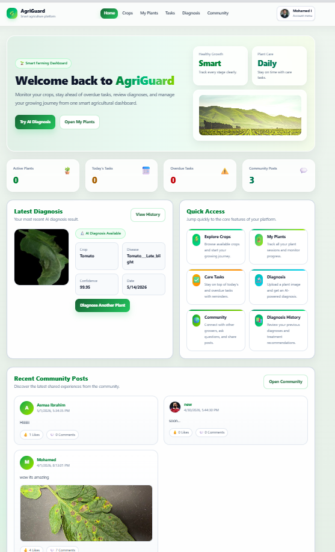
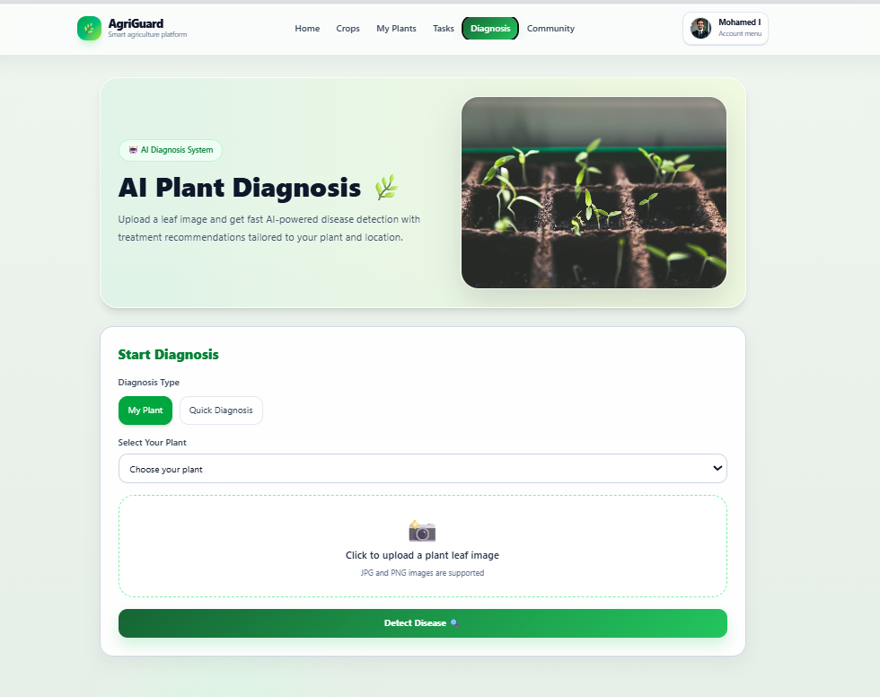
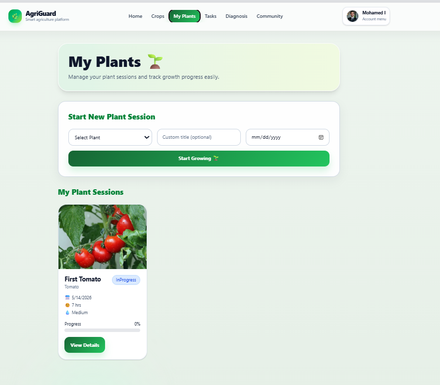
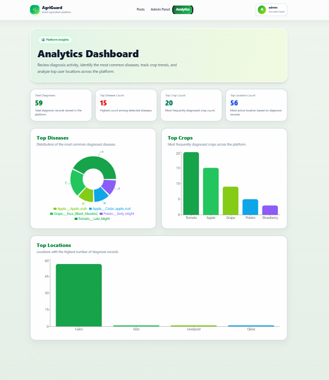

# AgriGuard 🌿  
## Intelligent System for Plant Disease Diagnosis and Smart Crop Management

AgriGuard is a full-stack AI-powered agricultural platform designed to help farmers and home gardeners diagnose plant diseases, manage crop care tasks, and share agricultural knowledge through a community hub.

## Project Repositories

- Frontend: https://github.com/MohamadElanany/AgriGuard-Front
- Backend: https://github.com/MohamadElanany/AgriGuard-Backend
- AI Microservice: https://github.com/MohamadElanany/AgriGuard_AI_API

## Key Features

- AI-powered plant disease diagnosis
- Smart crop care scheduling
- Automated watering and fertilization tasks
- Gemini AI treatment recommendations
- Community posts, comments, and likes
- Admin dashboard for managing crops, users, posts, and locations
- JWT authentication and role-based authorization

## Technologies Used

### Frontend
React.js, Vite, Tailwind CSS, Axios

### Backend
ASP.NET Core Web API, Entity Framework Core, SQL Server, JWT, BCrypt

### AI Microservice
Python, FastAPI, TensorFlow/Keras, MobileNetV2

## System Architecture

React Frontend → ASP.NET Core Web API → FastAPI AI Microservice → TensorFlow/Keras Model

##  Screenshots

### Dashboard

---

### AI Diagnosis

---

### My Plants

---

### Analytics Dashboard

---

### User Profile

## Author

Mohamed Ibrahim
